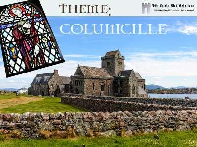

# Columcille
__Columcille__ is a child theme for the basic OCWS framework theme, [Qohelet](https://github.com/pftaylor61/qohelet/). Like its parent theme, Columcille is a fully responsive theme for Wordpress applications. It therefore makes full use of the following open source technologies: 1. The Quark starter theme by Anthony Horton. 2. Quark is in turn built upon Underscores by Automattix. 3. Quark utilizes Normalize, Modernizr and Options Framework. 4. Qohelet contains Kirki, to enableeasy use of the Customizer. So Columcille makes use of this technology. 5. Many other smaller amounts of other technologies have been incorporated, so that I did not re-invent the wheel. Columcille is itself open source, and its code is stored at Github.

## Version 0.2
Initial working model improved, to work with phones and tablets.

## Version 0.0.1
The initial working model. Customizer panels have been added, but are not yet working.

## Towards Initial Stable Version
The initial stable version will be 1.0, and it is only with that version that the Customizer panels will fully work.
